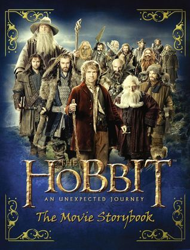

# app-dev
My first repository
# My Favorite Movie.

## The Hobbit

**Author**: J.R.R. Tolkien  
**Genres**: Fantasy, Adventure  

**About**:  
Hobbits, a race of small humanlike creatures, characteristically value peace, simplicity, and cozy homes yet are capable of incredible feats of courage and resourcefulness. The unwilling hero of The Hobbit, Bilbo Baggins, is persuaded by the wizard Gandalf to leave his village, Hobbiton, and join Thorin and his 12 dwarfs to recover their stolen treasure, which is being guarded by the dragon Smaug. During the expedition, Bilbo finds a magical ring that renders the wearer invisible, which figures prominently in The Lord of the Rings, a novel originally published in three parts that followed in 1954−55. When Bilbo and Gandalf return to Hobbiton, Bilbo is no longer accepted, his adventurous behavior being deemed unhobbitlike. The Hobbit is the story of Bilbo’s maturing from a seeker of warmth and comforts to a fighter, however humble, for the greater good. He proves to be an unlikely hero who achieves metamorphosis through pools of inner strength he did not know he possessed.

---
